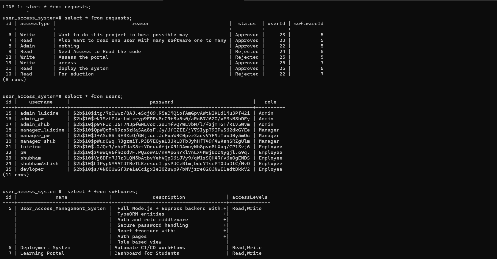

# 🛡️ User Access Management System

A full-stack role-based access system built using **Node.js**, **React**, **PostgreSQL**, and **TypeORM**, allowing users to register, request software access, and enabling managers/admins to control software and permissions.

---

## 📽️ Demo Video

👉 [https://youtu.be/UM_H6Tz0fSg](#) 
`My Youtube Channel`
---

## 📸 Screenshots

| Login Page                      | Signup Page                       |
| ------------------------------- | --------------------------------- |
| ! |  |

| Create Software (Admin)                    | Request Access (Employee)                  | Pending Requests (Manager)                   |
| ------------------------------------------ | ------------------------------------------ | -------------------------------------------- |
|  | |  |

Database


---

## 🧠 Features

* ✅ User Registration (Employee by default)
* ✅ JWT Authentication
* ✅ Role-based Routing (Admin / Manager / Employee)
* ✅ Admin: Create and manage software
* ✅ Employee: Submit access requests for software
* ✅ Manager: View, approve, or reject access requests
* ✅ Responsive UI built with Tailwind CSS
* ✅ Clean modular backend (TypeORM + Express)

---

## 🚀 Tech Stack

### 🔧 Backend

* Node.js
* Express.js
* PostgreSQL
* TypeORM
* JWT Authentication
* Bcrypt Password Hashing

### 💻 Frontend

* Vite + React
* Tailwind CSS
* Context API (for auth state)
* React Router DOM
* Axios (API calls)

---

## 🛠️ Setup Instructions

### 📂 Folder Structure

```
Leucine Assignment PW/
├── backend/
└── frontend/
```

### 🔧 Backend Setup

```bash
npm i

# Configure your .env file
cp .env.example .env

# Create PostgreSQL DB manually (name: user_access_system)

npm run dev
```

### 🧪 Frontend Setup

```bash
cd frontend
npm install
npm run dev
```

Visit: [http://localhost:5173](http://localhost:5173)

---

## 🧪 Test Roles

You can use different roles to test behavior:

| Role     | Default Action                 | Pages               |
| -------- | ------------------------------ | ------------------- |
| Admin    | Create software                | `/create-software`  |
| Manager  | Approve/reject access requests | `/pending-requests` |
| Employee | Request access to software     | `/request-access`   |

---

## 📦 API Endpoints

### Auth

* `POST /api/auth/signup` → Default role: Employee
* `POST /api/auth/login` → Returns token + user info

### Software (Admin only)

* `POST /api/software`
* `GET /api/software`

### Access Requests

* `POST /api/requests` (Employee only)
* `GET /api/requests` (Manager only)
* `PATCH /api/requests/:id` (Manager only)

---

## 📂 Environment Variables

### 📁 `.env.example`

```
PORT=5000
DB_HOST=localhost
DB_PORT=5432
DB_USERNAME=postgres
DB_PASSWORD=yourpassword
DB_NAME=user_access_system
JWT_SECRET=your_jwt_secret
```

---

## 👨‍💻 Developer Notes

* React frontend is protected via `ProtectedRoute` component based on JWT + user role
* AuthContext handles token storage and user state via `localStorage`
* Backend routes are secured with middleware (`authenticate`, `authorizeRoles`)

---

## 📌 Future Improvements

* Add pagination to manager request view
* Allow Admin to assign Manager roles
* Email notifications for approvals
* Deploy on Railway / Vercel

---

## 📬 Contact

If you liked this project or have feedback:

* 🧑‍💻 Shubham Kumar 
* 📧 [shubham.ashish@gmail.com](mailto:shubham.ashish@gmail.com)

---

**Built with ❤️ by Shubham | [GitHub Profile](#)**
